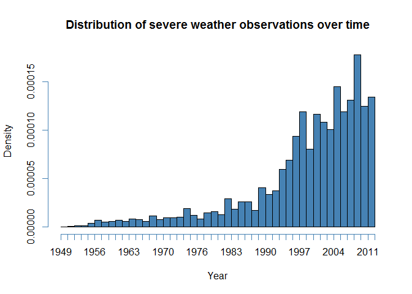

# Analysis of harm caused by severe weather events
Timothy Johnstone  

## Synopsis

*describes and summarizes the data analysis in less than 10 sentences*

## Data Processing

Before starting any analysis, we load all external libraries required for the code below. Note that this analysis requires the following libraries: *ggplot2*, *Hmisc*

```r
require(ggplot2)
```

```
## Loading required package: ggplot2
```

```r
require(Hmisc)
```


Data were made available via the Coursera site as a bzipped csv file, and are originally provided by the U.S. National Oceanic and Atmospheric Administration's (NOAA) storm database. Original documentation can be found [here](http://www.ncdc.noaa.gov/stormevents/pd01016005curr.pdf).

The first step is to read in the data from the bz2 file provided.


```r
# read.csv should handle bzip compressed files automatically, but we use bzfile just in case 
weather <- read.csv(bzfile('repdata_data_StormData.csv.bz2'), header=T, na.strings = "")
```

Before working with the dataset, let's make sure it loaded in properly by checking the first few columns:

```r
summary(weather[,1:10])
```

```
##     STATE__                  BGN_DATE             BGN_TIME     
##  Min.   : 1.0   5/25/2011 0:00:00:  1202   12:00:00 AM: 10163  
##  1st Qu.:19.0   4/27/2011 0:00:00:  1193   06:00:00 PM:  7350  
##  Median :30.0   6/9/2011 0:00:00 :  1030   04:00:00 PM:  7261  
##  Mean   :31.2   5/30/2004 0:00:00:  1016   05:00:00 PM:  6891  
##  3rd Qu.:45.0   4/4/2011 0:00:00 :  1009   12:00:00 PM:  6703  
##  Max.   :95.0   4/2/2006 0:00:00 :   981   03:00:00 PM:  6700  
##                 (Other)          :895866   (Other)    :857229  
##    TIME_ZONE          COUNTY           COUNTYNAME         STATE       
##  CST    :547493   Min.   :  0.0   JEFFERSON :  7840   TX     : 83728  
##  EST    :245558   1st Qu.: 31.0   WASHINGTON:  7603   KS     : 53440  
##  MST    : 68390   Median : 75.0   JACKSON   :  6660   OK     : 46802  
##  PST    : 28302   Mean   :100.6   FRANKLIN  :  6256   MO     : 35648  
##  AST    :  6360   3rd Qu.:131.0   LINCOLN   :  5937   IA     : 31069  
##  HST    :  2563   Max.   :873.0   (Other)   :866412   NE     : 30271  
##  (Other):  3631                   NA's      :  1589   (Other):621339  
##                EVTYPE         BGN_RANGE           BGN_AZI      
##  HAIL             :288661   Min.   :   0.000   N      : 86752  
##  TSTM WIND        :219940   1st Qu.:   0.000   W      : 38446  
##  THUNDERSTORM WIND: 82563   Median :   0.000   S      : 37558  
##  TORNADO          : 60652   Mean   :   1.484   E      : 33178  
##  FLASH FLOOD      : 54277   3rd Qu.:   1.000   NW     : 24041  
##  FLOOD            : 25326   Max.   :3749.000   (Other):134990  
##  (Other)          :170878                      NA's   :547332
```

Since the weather events are organized by when they occurred, we'll check the distribution over the years to get an idea of the density over time.


```r
# Properly format dates as posix dates and plot begin dates on a histogram
weather$BGN_DATE <- as.Date(weather$BGN_DATE, format = "%m/%d/%Y %H:%M:%S")
hist(weather$BGN_DATE, 
     col="steelblue",
     xlab="Year", breaks=40,
     main="Distribution of severe weather observations over time")
```

 

```r
weather$END_DATE <- format(as.Date(weather$END_DATE, format = "%m/%d/%Y %H:%M:%S"), "%m/%d/%Y")
```

By eye, it seems like the observations start increasing around 1990. Since there's likely to be missing and/or lower quality data before this point, let's just check that we won't be eliminating too much of the dataset by subsetting to dates after 1990. We do this by looking at the decile cutoffs for our date set. 

```r
as.Date(quantile(as.numeric(weather$BGN_DATE), seq(0.1, 1, by=0.1)), origin="1970-01-01")
```

```
##          10%          20%          30%          40%          50% 
## "1982-06-21" "1992-06-24" "1996-07-21" "1999-05-23" "2002-03-18" 
##          60%          70%          80%          90%         100% 
## "2004-06-02" "2006-07-13" "2008-06-17" "2010-06-11" "2011-11-30"
```
It looks like we'll be eliminating less than 20% of the observations in order to ensure higher quality/frequency of observations. This will also make the dataset easier to work with, so let's do it!

```r
cutoff1990 <- as.numeric(as.Date("01/01/1990", format = "%m/%d/%Y"))
weather <- weather[as.numeric(weather$BGN_DATE) >= cutoff1990,]
# I would plot another histogram to see that the distribution is more balanced, but we are limited to 3 plots in our output...........
#hist(weather$BGN_DATE, 
#     col="steelblue",
#     xlab="Year", breaks=20,
#     main="Distribution of severe weather observations over time, after date filtering")
```
This looks like a more balanced distribution.

Now we can also subset the table to just the columns that we will be using for the weather consequences analysis. This will shrink the table and make the data easier to work with. Preserved columns are the following:


```r
data.frame("Variable Name"=c(),
           "Description"=c())
```

```
## data frame with 0 columns and 0 rows
```

| Variable Name | Description                                            |  
|---------------|--------------------------------------------------------|  
| BGN_DATE      | The date (mm-dd-yyyy) of the severe weather event      |  
| EVTYPE        | The type of weather event e.g. thunderstorm            |  
| FATALITIES    | Number of fatalities resulting from the weather event  |  
| INJURIES      | Number of injuries resulting from the weather event    |  
| PROPDMG       | Property damage, in USD                                |  
| PROPDMGEXP    | Multiplier for property damage, according to NOAA code |  
| CROPDMG       | Agricultural crop damage, in USD                       |  
| CROPDMGEXP    | Multiplier for crop damage, according to NOAA code     |  


```r
weather <- weather[, c("EVTYPE","FATALITIES","INJURIES", "PROPDMG", "PROPDMGEXP", "CROPDMG", "CROPDMGEXP")]
```

Next, we have to process a few columns which use specific encoding of exponents in order to recover the original numeric values. Looking at the original codebook, there are two columns, *CROPDMGEXP* and *PROPDMGEXP*, that represent the size units of the *PROPDMG* and *CROPDMG* columns respectively. 


## Results

### Effects of severe weather events on population health

Across the United States, which types of events (as indicated in the EVTYPE variable) are most harmful with respect to population health?

### Economic consequences of severe weather events

Across the United States, which types of events have the greatest economic consequences?

## Conclusions

*At most 3 figures*
