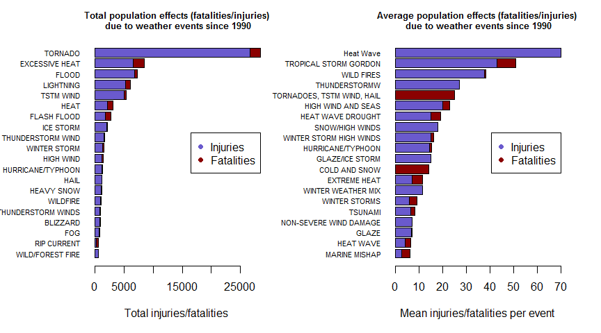
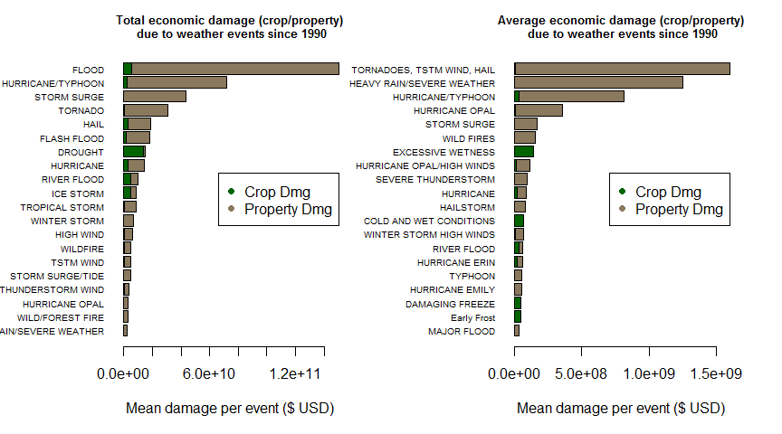

# Analysis of harm caused by severe weather events
Timothy Johnstone  

## Synopsis

*The following analysis breaks down the harm caused by severe weather events since 1990. We examine population health effects (injuries/fatalities) to find the most consistently harmful weather types as well as the most harmful overall. We also examine economic damages to find the most consistently damaging weather types as well as the most harmful overall.*

## Data Processing

Before starting any analysis, we load all external libraries required for the code below. Note that this analysis requires the following libraries: *ggplot2*, *Hmisc*, *xtable*


```r
require(ggplot2)
require(Hmisc)
require(xtable)
```


Data were made available via the Coursera site as a bzipped csv file, and are originally provided by the U.S. National Oceanic and Atmospheric Administration's (NOAA) storm database. Original documentation can be found [here](http://www.ncdc.noaa.gov/stormevents/pd01016005curr.pdf).

The first step is to read in the data from the bz2 file provided.


```r
setwd("Z:/Lotus/Dropbox/Coursera/5_Reproducible_Research/Projects/RR_Proj2_HarmfulWeatherEvents")
# read.csv should handle bzip compressed files automatically, but we use bzfile just in case 
weather <- read.csv(bzfile('repdata_data_StormData.csv.bz2'), header=T, na.strings = "")
```

Before working with the dataset, let's make sure it loaded in properly by checking the first few columns:

```r
summary(weather[,1:10])
```

```
##     STATE__                  BGN_DATE             BGN_TIME     
##  Min.   : 1.0   5/25/2011 0:00:00:  1202   12:00:00 AM: 10163  
##  1st Qu.:19.0   4/27/2011 0:00:00:  1193   06:00:00 PM:  7350  
##  Median :30.0   6/9/2011 0:00:00 :  1030   04:00:00 PM:  7261  
##  Mean   :31.2   5/30/2004 0:00:00:  1016   05:00:00 PM:  6891  
##  3rd Qu.:45.0   4/4/2011 0:00:00 :  1009   12:00:00 PM:  6703  
##  Max.   :95.0   4/2/2006 0:00:00 :   981   03:00:00 PM:  6700  
##                 (Other)          :895866   (Other)    :857229  
##    TIME_ZONE          COUNTY           COUNTYNAME         STATE       
##  CST    :547493   Min.   :  0.0   JEFFERSON :  7840   TX     : 83728  
##  EST    :245558   1st Qu.: 31.0   WASHINGTON:  7603   KS     : 53440  
##  MST    : 68390   Median : 75.0   JACKSON   :  6660   OK     : 46802  
##  PST    : 28302   Mean   :100.6   FRANKLIN  :  6256   MO     : 35648  
##  AST    :  6360   3rd Qu.:131.0   LINCOLN   :  5937   IA     : 31069  
##  HST    :  2563   Max.   :873.0   (Other)   :866412   NE     : 30271  
##  (Other):  3631                   NA's      :  1589   (Other):621339  
##                EVTYPE         BGN_RANGE           BGN_AZI      
##  HAIL             :288661   Min.   :   0.000   N      : 86752  
##  TSTM WIND        :219940   1st Qu.:   0.000   W      : 38446  
##  THUNDERSTORM WIND: 82563   Median :   0.000   S      : 37558  
##  TORNADO          : 60652   Mean   :   1.484   E      : 33178  
##  FLASH FLOOD      : 54277   3rd Qu.:   1.000   NW     : 24041  
##  FLOOD            : 25326   Max.   :3749.000   (Other):134990  
##  (Other)          :170878                      NA's   :547332
```

Since the weather events are organized by when they occurred, we'll check the distribution over the years to get an idea of the density over time.


```r
# Properly format dates as posix dates and plot begin dates on a histogram
weather$BGN_DATE <- as.Date(weather$BGN_DATE, format = "%m/%d/%Y %H:%M:%S")
hist(weather$BGN_DATE, 
     col="steelblue",
     xlab="Year", breaks=40,
     main="Distribution of severe weather observations over time")
```

 

```r
weather$END_DATE <- format(as.Date(weather$END_DATE, format = "%m/%d/%Y %H:%M:%S"), "%m/%d/%Y")
```

By eye, it seems like the observations start increasing around 1990. Since there's likely to be missing and/or lower quality data before this point, let's just check that we won't be eliminating too much of the dataset by subsetting to dates after 1990. We do this by looking at the decile cutoffs for our date set. 

```r
as.Date(quantile(as.numeric(weather$BGN_DATE), seq(0.1, 1, by=0.1)), origin="1970-01-01")
```

```
##          10%          20%          30%          40%          50% 
## "1982-06-21" "1992-06-24" "1996-07-21" "1999-05-23" "2002-03-18" 
##          60%          70%          80%          90%         100% 
## "2004-06-02" "2006-07-13" "2008-06-17" "2010-06-11" "2011-11-30"
```
It looks like we'll be eliminating less than 20% of the observations in order to ensure higher quality/frequency of observations. This will also make the dataset easier to work with, so let's do it!

```r
cutoff1990 <- as.numeric(as.Date("01/01/1990", format = "%m/%d/%Y"))
weather <- weather[as.numeric(weather$BGN_DATE) >= cutoff1990,]
# I would plot another histogram to see that the distribution is more balanced, but we are limited to 3 plots in our output...........
#hist(weather$BGN_DATE, 
#     col="steelblue",
#     xlab="Year", breaks=20,
#     main="Distribution of severe weather observations over time, after date filtering")
```
This looks like a more balanced distribution.

Now we can also subset the table to just the columns that we will be using for the weather consequences analysis. This will shrink the table and make the data easier to work with. Preserved columns are the following:

| Variable Name | Description                                            |  
|---------------|--------------------------------------------------------|  
| BGN_DATE      | The date (mm-dd-yyyy) of the severe weather event      |  
| EVTYPE        | The type of weather event e.g. thunderstorm            |  
| FATALITIES    | Number of fatalities resulting from the weather event  |  
| INJURIES      | Number of injuries resulting from the weather event    |  
| PROPDMG       | Property damage, in USD                                |  
| PROPDMGEXP    | Multiplier for property damage, according to NOAA code |  
| CROPDMG       | Agricultural crop damage, in USD                       |  
| CROPDMGEXP    | Multiplier for crop damage, according to NOAA code     |  


```r
weather <- weather[, c("EVTYPE","FATALITIES","INJURIES", "PROPDMG", "PROPDMGEXP", "CROPDMG", "CROPDMGEXP")]
```

Next, we have to process a few columns which use specific encoding of exponents in order to recover the original numeric values. Looking at the original codebook, there are two columns, *PROPDMGEXP* and *CROPDMGEXP*, that represent the size units of the *PROPDMG* and *CROPDMG* columns respectively. 


```r
levels(weather$PROPDMGEXP)
```

```
##  [1] "-" "?" "+" "0" "1" "2" "3" "4" "5" "6" "7" "8" "B" "h" "H" "K" "m"
## [18] "M"
```

```r
levels(weather$CROPDMGEXP)
```

```
## [1] "?" "0" "2" "B" "k" "K" "m" "M"
```

```r
#So what are all possible exponent representations that we will have to deal with?
exps <- c(NA,union(levels(weather$PROPDMGEXP), levels(weather$CROPDMGEXP)))
exps
```

```
##  [1] NA  "-" "?" "+" "0" "1" "2" "3" "4" "5" "6" "7" "8" "B" "h" "H" "K"
## [18] "m" "M" "k"
```

Though I could not find information regarding some codes (+,-,?) in the NOAA database handbook, the others are easily interpretable and must be converted before they can be applied to the DMG columns. There's no good way to do this automatically, so I will make a translation table and use it on both crop and prop damage. I will assume that damage codes of +, -, and ? should be translated to 1e0, meaning they will not exponentiate the damage value.


```r
translateExp <- data.frame("exp"=exps,
                           "num"=c(1e0, 1e0, 1e0, 1e0,
                                   1e0, 1e1, 1e2, 1e3, 1e4, 1e5, 1e6, 1e7, 1e8,
                                   1e9, 1e2, 1e2, 1e3, 1e6, 1e6, 1e3))
weather$CROPDMGabs <- weather$CROPDMG * translateExp$num[match(weather$CROPDMGEXP,translateExp$exp)]
weather$PROPDMGabs <- weather$PROPDMG * translateExp$num[match(weather$PROPDMGEXP,translateExp$exp)]
```


## Results

### Effects of severe weather events on population health

**Across the United States, which types of events (as indicated in the EVTYPE variable) are most harmful with respect to population health?**

#### Injuries by severe weather type

First, let's aggregate injuries by weather type and take a look at the total/average injuries for each type of weather event.


```r
# Aggregate by type and sort descending by # of injuries
injByType_total <- aggregate(INJURIES ~ EVTYPE, data=weather, sum, na.rm=T)
injByType_total <- injByType_total[order(-injByType_total$INJURIES),]
injByType_mean <- aggregate(INJURIES ~ EVTYPE, data=weather, mean, na.rm=T)
injByType_mean <- injByType_mean[order(-injByType_mean$INJURIES),]
tail(injByType_total)
```

```
##                      EVTYPE INJURIES
## 975 WINTER STORM/HIGH WINDS        0
## 977          Winter Weather        0
## 981             WINTERY MIX        0
## 982              Wintry mix        0
## 983              Wintry Mix        0
## 985                     WND        0
```

Note here that we see 3 different entries for the same weather type (WINTERY MIX, Wintry Mix, Wintry mix), indicating some inconsistencies in coding the data collection. In a real-world scenario, these should probably be merged, but for this assignment they will be kept separate. 

We also check how many of them result in any injuries at all - cursory glances at the table show a lot of zeroes. 


```r
# Check how many weather event types result in any recorded injuries
injuriousTypes <- sum(injByType_total$INJURIES>0)/nrow(injByType_total)*100
```

Only 16.0406091% of weather types result in any injuries. 

Next, let's actually take a look at the most injuring weather types. We do this with a table to enumerate the top 10 most damaging weather types, in terms of total and average injuries reported/recorded.

**Total Injuries**


```r
# Print the top 10 most injuring weather types, by total injuries
print(xtable(injByType_total[1:10,1:2]), type='html')
```

<!-- html table generated in R 3.1.3 by xtable 1.7-4 package -->
<!-- Sat Jun 20 16:56:27 2015 -->
<table border=1>
<tr> <th>  </th> <th> EVTYPE </th> <th> INJURIES </th>  </tr>
  <tr> <td align="right"> 834 </td> <td> TORNADO </td> <td align="right"> 26674.00 </td> </tr>
  <tr> <td align="right"> 170 </td> <td> FLOOD </td> <td align="right"> 6789.00 </td> </tr>
  <tr> <td align="right"> 130 </td> <td> EXCESSIVE HEAT </td> <td align="right"> 6525.00 </td> </tr>
  <tr> <td align="right"> 464 </td> <td> LIGHTNING </td> <td align="right"> 5230.00 </td> </tr>
  <tr> <td align="right"> 856 </td> <td> TSTM WIND </td> <td align="right"> 5022.00 </td> </tr>
  <tr> <td align="right"> 275 </td> <td> HEAT </td> <td align="right"> 2100.00 </td> </tr>
  <tr> <td align="right"> 427 </td> <td> ICE STORM </td> <td align="right"> 1975.00 </td> </tr>
  <tr> <td align="right"> 153 </td> <td> FLASH FLOOD </td> <td align="right"> 1777.00 </td> </tr>
  <tr> <td align="right"> 760 </td> <td> THUNDERSTORM WIND </td> <td align="right"> 1488.00 </td> </tr>
  <tr> <td align="right"> 972 </td> <td> WINTER STORM </td> <td align="right"> 1321.00 </td> </tr>
   </table>


**Average Injuries**


```r
# Print the top 10 most injuring weather types, by mean injuries
print(xtable(injByType_mean[1:10,1:2]), type='html')
```

<!-- html table generated in R 3.1.3 by xtable 1.7-4 package -->
<!-- Sat Jun 20 16:56:27 2015 -->
<table border=1>
<tr> <th>  </th> <th> EVTYPE </th> <th> INJURIES </th>  </tr>
  <tr> <td align="right"> 277 </td> <td> Heat Wave </td> <td align="right"> 70.00 </td> </tr>
  <tr> <td align="right"> 851 </td> <td> TROPICAL STORM GORDON </td> <td align="right"> 43.00 </td> </tr>
  <tr> <td align="right"> 954 </td> <td> WILD FIRES </td> <td align="right"> 37.50 </td> </tr>
  <tr> <td align="right"> 821 </td> <td> THUNDERSTORMW </td> <td align="right"> 27.00 </td> </tr>
  <tr> <td align="right"> 366 </td> <td> HIGH WIND AND SEAS </td> <td align="right"> 20.00 </td> </tr>
  <tr> <td align="right"> 656 </td> <td> SNOW/HIGH WINDS </td> <td align="right"> 18.00 </td> </tr>
  <tr> <td align="right"> 224 </td> <td> GLAZE/ICE STORM </td> <td align="right"> 15.00 </td> </tr>
  <tr> <td align="right"> 279 </td> <td> HEAT WAVE DROUGHT </td> <td align="right"> 15.00 </td> </tr>
  <tr> <td align="right"> 973 </td> <td> WINTER STORM HIGH WINDS </td> <td align="right"> 15.00 </td> </tr>
  <tr> <td align="right"> 411 </td> <td> HURRICANE/TYPHOON </td> <td align="right"> 14.49 </td> </tr>
   </table>

As you can see, the top ten events in terms of total injuries differ from the top event types in terms of average injuries. Tornadoes and floods have caused the most injuries overall since 1990, but heat waves, wild fires, and thunderstorms are the most consistently injurious.

#### Fatalities by severe weather type
First, let's aggregate fatalities by weather type and take a look at the total/average deaths for each type of weather event.


```r
# Aggregate by type and sort descending by # of fatalities
fatByType_total <- aggregate(FATALITIES ~ EVTYPE, data=weather, sum, na.rm=T)
fatByType_total <- fatByType_total[order(-fatByType_total$FATALITIES),]
fatByType_mean <- aggregate(FATALITIES ~ EVTYPE, data=weather, mean, na.rm=T)
fatByType_mean <- fatByType_mean[order(-fatByType_mean$FATALITIES),]
tail(fatByType_total)
```

```
##                 EVTYPE FATALITIES
## 977     Winter Weather          0
## 979 WINTER WEATHER MIX          0
## 981        WINTERY MIX          0
## 982         Wintry mix          0
## 983         Wintry Mix          0
## 985                WND          0
```

We also check how many of them result in any fatalities at all, as again, cursory glances at the table show a lot of zeroes. 


```r
# Check how many weather event types result in any recorded injuries
fatalTypes <- sum(fatByType_total$FATALITIES>0)/nrow(fatByType_total)*100
```

Only 17.0558376% of weather types result in any deaths. 

Next, let's actually take a look at the most fatal weather types. We do this with a table to enumerate the top 10 most fatal weather types, in terms of total and average deaths reported/recorded.

**Total Fatalities**


```r
# Print the top 10 most injuring weather types, by total injuries
print(xtable(fatByType_total[1:10,1:2]), type='html')
```

<!-- html table generated in R 3.1.3 by xtable 1.7-4 package -->
<!-- Sat Jun 20 16:56:39 2015 -->
<table border=1>
<tr> <th>  </th> <th> EVTYPE </th> <th> FATALITIES </th>  </tr>
  <tr> <td align="right"> 130 </td> <td> EXCESSIVE HEAT </td> <td align="right"> 1903.00 </td> </tr>
  <tr> <td align="right"> 834 </td> <td> TORNADO </td> <td align="right"> 1752.00 </td> </tr>
  <tr> <td align="right"> 153 </td> <td> FLASH FLOOD </td> <td align="right"> 978.00 </td> </tr>
  <tr> <td align="right"> 275 </td> <td> HEAT </td> <td align="right"> 937.00 </td> </tr>
  <tr> <td align="right"> 464 </td> <td> LIGHTNING </td> <td align="right"> 816.00 </td> </tr>
  <tr> <td align="right"> 170 </td> <td> FLOOD </td> <td align="right"> 470.00 </td> </tr>
  <tr> <td align="right"> 585 </td> <td> RIP CURRENT </td> <td align="right"> 368.00 </td> </tr>
  <tr> <td align="right"> 856 </td> <td> TSTM WIND </td> <td align="right"> 327.00 </td> </tr>
  <tr> <td align="right"> 359 </td> <td> HIGH WIND </td> <td align="right"> 248.00 </td> </tr>
  <tr> <td align="right"> 19 </td> <td> AVALANCHE </td> <td align="right"> 224.00 </td> </tr>
   </table>

**Average Fatalities**


```r
# Print the top 10 most injuring weather types, by mean injuries
print(xtable(fatByType_mean[1:10,1:2]), type='html')
```

<!-- html table generated in R 3.1.3 by xtable 1.7-4 package -->
<!-- Sat Jun 20 16:56:39 2015 -->
<table border=1>
<tr> <th>  </th> <th> EVTYPE </th> <th> FATALITIES </th>  </tr>
  <tr> <td align="right"> 842 </td> <td> TORNADOES, TSTM WIND, HAIL </td> <td align="right"> 25.00 </td> </tr>
  <tr> <td align="right"> 72 </td> <td> COLD AND SNOW </td> <td align="right"> 14.00 </td> </tr>
  <tr> <td align="right"> 851 </td> <td> TROPICAL STORM GORDON </td> <td align="right"> 8.00 </td> </tr>
  <tr> <td align="right"> 580 </td> <td> RECORD/EXCESSIVE HEAT </td> <td align="right"> 5.67 </td> </tr>
  <tr> <td align="right"> 142 </td> <td> EXTREME HEAT </td> <td align="right"> 4.36 </td> </tr>
  <tr> <td align="right"> 279 </td> <td> HEAT WAVE DROUGHT </td> <td align="right"> 4.00 </td> </tr>
  <tr> <td align="right"> 373 </td> <td> HIGH WIND/SEAS </td> <td align="right"> 4.00 </td> </tr>
  <tr> <td align="right"> 487 </td> <td> MARINE MISHAP </td> <td align="right"> 3.50 </td> </tr>
  <tr> <td align="right"> 976 </td> <td> WINTER STORMS </td> <td align="right"> 3.33 </td> </tr>
  <tr> <td align="right"> 340 </td> <td> Heavy surf and wind </td> <td align="right"> 3.00 </td> </tr>
   </table>

As you can see, the top ten events in terms of total deaths are pretty similar to the top event types in terms of average deaths. Excessive heat, tornadoes and floods have caused the most deaths overall since 1990, with tornadoes, cold/snow, and heat waves being the most consistently fatal. It is worth noting that there is significant redundancy in the reported weather types (e.g. excessive heat, extreme heat, heat waves) and proper treatment of these event types would increase the accuracy of this analysis.

#### Overall population health effects of severe weather

Now let's combine the injury and fatality data and look at the aggregate as a reflection of population health effects.


```r
allByType_total <- merge(injByType_total, fatByType_total, by="EVTYPE")
allByType_total$TOTAL <- allByType_total$INJURIES + allByType_total$FATALITIES
allByType_total <- allByType_total[order(-allByType_total$TOTAL),]
allByType_mean <- merge(injByType_mean, fatByType_mean, by="EVTYPE")
allByType_mean$TOTAL <- allByType_mean$INJURIES + allByType_mean$FATALITIES
allByType_mean <- allByType_mean[order(-allByType_mean$TOTAL),]
```

We then print the top 10 by mean and total, sorted by the sum of injuries and fatalities caused aka the total health events

**Total Health Events**


```r
print(xtable(allByType_total[1:10,1:4]), type='html')
```

<!-- html table generated in R 3.1.3 by xtable 1.7-4 package -->
<!-- Sat Jun 20 16:56:39 2015 -->
<table border=1>
<tr> <th>  </th> <th> EVTYPE </th> <th> INJURIES </th> <th> FATALITIES </th> <th> TOTAL </th>  </tr>
  <tr> <td align="right"> 834 </td> <td> TORNADO </td> <td align="right"> 26674.00 </td> <td align="right"> 1752.00 </td> <td align="right"> 28426.00 </td> </tr>
  <tr> <td align="right"> 130 </td> <td> EXCESSIVE HEAT </td> <td align="right"> 6525.00 </td> <td align="right"> 1903.00 </td> <td align="right"> 8428.00 </td> </tr>
  <tr> <td align="right"> 170 </td> <td> FLOOD </td> <td align="right"> 6789.00 </td> <td align="right"> 470.00 </td> <td align="right"> 7259.00 </td> </tr>
  <tr> <td align="right"> 464 </td> <td> LIGHTNING </td> <td align="right"> 5230.00 </td> <td align="right"> 816.00 </td> <td align="right"> 6046.00 </td> </tr>
  <tr> <td align="right"> 856 </td> <td> TSTM WIND </td> <td align="right"> 5022.00 </td> <td align="right"> 327.00 </td> <td align="right"> 5349.00 </td> </tr>
  <tr> <td align="right"> 275 </td> <td> HEAT </td> <td align="right"> 2100.00 </td> <td align="right"> 937.00 </td> <td align="right"> 3037.00 </td> </tr>
  <tr> <td align="right"> 153 </td> <td> FLASH FLOOD </td> <td align="right"> 1777.00 </td> <td align="right"> 978.00 </td> <td align="right"> 2755.00 </td> </tr>
  <tr> <td align="right"> 427 </td> <td> ICE STORM </td> <td align="right"> 1975.00 </td> <td align="right"> 89.00 </td> <td align="right"> 2064.00 </td> </tr>
  <tr> <td align="right"> 760 </td> <td> THUNDERSTORM WIND </td> <td align="right"> 1488.00 </td> <td align="right"> 133.00 </td> <td align="right"> 1621.00 </td> </tr>
  <tr> <td align="right"> 972 </td> <td> WINTER STORM </td> <td align="right"> 1321.00 </td> <td align="right"> 206.00 </td> <td align="right"> 1527.00 </td> </tr>
   </table>


**Mean Total Health Events**


```r
print(xtable(allByType_mean[1:10,1:4]), type='html')
```

<!-- html table generated in R 3.1.3 by xtable 1.7-4 package -->
<!-- Sat Jun 20 16:56:39 2015 -->
<table border=1>
<tr> <th>  </th> <th> EVTYPE </th> <th> INJURIES </th> <th> FATALITIES </th> <th> TOTAL </th>  </tr>
  <tr> <td align="right"> 277 </td> <td> Heat Wave </td> <td align="right"> 70.00 </td> <td align="right"> 0.00 </td> <td align="right"> 70.00 </td> </tr>
  <tr> <td align="right"> 851 </td> <td> TROPICAL STORM GORDON </td> <td align="right"> 43.00 </td> <td align="right"> 8.00 </td> <td align="right"> 51.00 </td> </tr>
  <tr> <td align="right"> 954 </td> <td> WILD FIRES </td> <td align="right"> 37.50 </td> <td align="right"> 0.75 </td> <td align="right"> 38.25 </td> </tr>
  <tr> <td align="right"> 821 </td> <td> THUNDERSTORMW </td> <td align="right"> 27.00 </td> <td align="right"> 0.00 </td> <td align="right"> 27.00 </td> </tr>
  <tr> <td align="right"> 842 </td> <td> TORNADOES, TSTM WIND, HAIL </td> <td align="right"> 0.00 </td> <td align="right"> 25.00 </td> <td align="right"> 25.00 </td> </tr>
  <tr> <td align="right"> 366 </td> <td> HIGH WIND AND SEAS </td> <td align="right"> 20.00 </td> <td align="right"> 3.00 </td> <td align="right"> 23.00 </td> </tr>
  <tr> <td align="right"> 279 </td> <td> HEAT WAVE DROUGHT </td> <td align="right"> 15.00 </td> <td align="right"> 4.00 </td> <td align="right"> 19.00 </td> </tr>
  <tr> <td align="right"> 656 </td> <td> SNOW/HIGH WINDS </td> <td align="right"> 18.00 </td> <td align="right"> 0.00 </td> <td align="right"> 18.00 </td> </tr>
  <tr> <td align="right"> 973 </td> <td> WINTER STORM HIGH WINDS </td> <td align="right"> 15.00 </td> <td align="right"> 1.00 </td> <td align="right"> 16.00 </td> </tr>
  <tr> <td align="right"> 411 </td> <td> HURRICANE/TYPHOON </td> <td align="right"> 14.49 </td> <td align="right"> 0.73 </td> <td align="right"> 15.22 </td> </tr>
   </table>


We can visualize this in a two-panel horizontal barplot of the most harmful weather types (in descending order, sorted by total harm and total mean harm). 


```r
# Prepare the data to be plotted
par(mar=c(5,7,3,3), mfrow=c(1,2))
colorsUsed <- c("slateblue","red4")
# Plot total effects
barplot(t(as.matrix(allByType_total[20:1,2:3])),
        horiz=T,
        names.arg = allByType_total[20:1,1],
        las=1,
        main="Total population effects (fatalities/injuries)\n due to weather events since 1990",
        xlab="Total injuries/fatalities",
        col=colorsUsed,
        cex.main=0.8,
        cex.names = 0.7
)
legend("right", col=colorsUsed, legend = c("Injuries","Fatalities"), pch=19)
# Plot mean effects
barplot(t(as.matrix(allByType_mean[20:1,2:3])),
        horiz=T,
        names.arg = allByType_mean[20:1,1],
        las=1,
        main="Average population effects (fatalities/injuries)\n due to weather events since 1990",
        xlab="Mean injuries/fatalities per event",
        col=colorsUsed,
        cex.main=0.8,
        cex.names=0.7
)
legend("right", col=colorsUsed, legend = c("Injuries","Fatalities"), pch=19)
```

 

Excessive heat, tornadoes and floods have caused the most population effects overall since 1990, with heat waves, tropical storms, and wildfires being the most consistently damaging (injuries/fatalities.

### Economic consequences of severe weather events

Across the United States, which types of events have the greatest economic consequences?

#### Property Damage

First, let's aggregate property damage by weather type and take a look at the total/average damage for each type of weather event.


```r
# Aggregate by type and sort descending by # of injuries
propByType_total <- aggregate(PROPDMGabs ~ EVTYPE, data=weather, sum, na.rm=T)
propByType_total <- propByType_total[order(-propByType_total$PROPDMGabs),]
propByType_mean <- aggregate(PROPDMGabs ~ EVTYPE, data=weather, mean, na.rm=T)
propByType_mean <- propByType_mean[order(-propByType_mean$PROPDMGabs),]
tail(propByType_total)
```

```
##                      EVTYPE PROPDMGabs
## 974  WINTER STORM/HIGH WIND          0
## 975 WINTER STORM/HIGH WINDS          0
## 977          Winter Weather          0
## 981             WINTERY MIX          0
## 982              Wintry mix          0
## 985                     WND          0
```

We also check how many of them result in any property damage at all - cursory glances at the table show a lot of zeroes. 


```r
# Check how many weather event types result in any recorded injuries
propTypes <- sum(propByType_total$PROPDMGabs>0)/nrow(propByType_total)*100
```

41.2182741% of weather types results in recorded property damage. 

Next, let's actually take a look at the most damaging weather types. We do this with a table to enumerate the top 10 most damaging weather types, in terms of total and average property dagmage reported/recorded.


**Total Property Damage**


```r
# Print the top 10 most damaging weather types, by total damage
print(xtable(propByType_total[1:10,1:2]), type='html')
```

<!-- html table generated in R 3.1.3 by xtable 1.7-4 package -->
<!-- Sat Jun 20 16:56:51 2015 -->
<table border=1>
<tr> <th>  </th> <th> EVTYPE </th> <th> PROPDMGabs </th>  </tr>
  <tr> <td align="right"> 170 </td> <td> FLOOD </td> <td align="right"> 144657709807.00 </td> </tr>
  <tr> <td align="right"> 411 </td> <td> HURRICANE/TYPHOON </td> <td align="right"> 69305840000.00 </td> </tr>
  <tr> <td align="right"> 670 </td> <td> STORM SURGE </td> <td align="right"> 43323536000.00 </td> </tr>
  <tr> <td align="right"> 834 </td> <td> TORNADO </td> <td align="right"> 30468735506.50 </td> </tr>
  <tr> <td align="right"> 153 </td> <td> FLASH FLOOD </td> <td align="right"> 16822673978.50 </td> </tr>
  <tr> <td align="right"> 244 </td> <td> HAIL </td> <td align="right"> 15735267512.70 </td> </tr>
  <tr> <td align="right"> 402 </td> <td> HURRICANE </td> <td align="right"> 11868319010.00 </td> </tr>
  <tr> <td align="right"> 848 </td> <td> TROPICAL STORM </td> <td align="right"> 7703890550.00 </td> </tr>
  <tr> <td align="right"> 972 </td> <td> WINTER STORM </td> <td align="right"> 6688497251.00 </td> </tr>
  <tr> <td align="right"> 359 </td> <td> HIGH WIND </td> <td align="right"> 5270046295.00 </td> </tr>
   </table>


**Average Property Damage**


```r
# Print the top 10 most damaging weather types, by mean damage
print(xtable(propByType_mean[1:10,1:2]), type='html')
```

<!-- html table generated in R 3.1.3 by xtable 1.7-4 package -->
<!-- Sat Jun 20 16:56:51 2015 -->
<table border=1>
<tr> <th>  </th> <th> EVTYPE </th> <th> PROPDMGabs </th>  </tr>
  <tr> <td align="right"> 842 </td> <td> TORNADOES, TSTM WIND, HAIL </td> <td align="right"> 1600000000.00 </td> </tr>
  <tr> <td align="right"> 298 </td> <td> HEAVY RAIN/SEVERE WEATHER </td> <td align="right"> 1250000000.00 </td> </tr>
  <tr> <td align="right"> 411 </td> <td> HURRICANE/TYPHOON </td> <td align="right"> 787566363.64 </td> </tr>
  <tr> <td align="right"> 409 </td> <td> HURRICANE OPAL </td> <td align="right"> 352538444.44 </td> </tr>
  <tr> <td align="right"> 670 </td> <td> STORM SURGE </td> <td align="right"> 165990559.39 </td> </tr>
  <tr> <td align="right"> 954 </td> <td> WILD FIRES </td> <td align="right"> 156025000.00 </td> </tr>
  <tr> <td align="right"> 410 </td> <td> HURRICANE OPAL/HIGH WINDS </td> <td align="right"> 100000000.00 </td> </tr>
  <tr> <td align="right"> 604 </td> <td> SEVERE THUNDERSTORM </td> <td align="right"> 92720000.00 </td> </tr>
  <tr> <td align="right"> 271 </td> <td> HAILSTORM </td> <td align="right"> 80333333.33 </td> </tr>
  <tr> <td align="right"> 402 </td> <td> HURRICANE </td> <td align="right"> 68208729.94 </td> </tr>
   </table>

As you can see, the top ten events in terms of total property damage differ slightly from the top event types in terms of average property damage. Floods, hurricanes, and storm surges have caused the most damage overall since 1990, but tornadoes, heavy rain, and hurricanes are the most consistently damaging to property.

#### Crop damage by severe weather type
First, let's aggregate crop damage by weather type and take a look at the total/average recorded damage for each type of weather event.


```r
# Aggregate by type and sort descending by # of fatalities
cropByType_total <- aggregate(CROPDMGabs ~ EVTYPE, data=weather, sum, na.rm=T)
cropByType_total <- cropByType_total[order(-cropByType_total$CROPDMGabs),]
cropByType_mean <- aggregate(CROPDMGabs ~ EVTYPE, data=weather, mean, na.rm=T)
cropByType_mean <- cropByType_mean[order(-cropByType_mean$CROPDMGabs),]
tail(cropByType_total)
```

```
##                 EVTYPE CROPDMGabs
## 980 WINTER WEATHER/MIX          0
## 981        WINTERY MIX          0
## 982         Wintry mix          0
## 983         Wintry Mix          0
## 984         WINTRY MIX          0
## 985                WND          0
```

We also check how many of them result in any crop damage at all, as again, cursory glances at the table show a lot of zeroes. 


```r
# Check how many weather event types result in any recorded injuries
cropTypes <- sum(cropByType_total$CROPDMGabs>0)/nrow(cropByType_total)*100
```

Compared to property damage, less crop damage is reported, with only 13.8071066% of weather types resulting in crop damage. 

Next, let's actually take a look at the most damaging weather types. We do this with a table to enumerate the top 10 most damaging weather types, in terms of total and average crop damage reported/recorded.


**Total Crop Damage**


```r
# Print the top 10 most damaging weather types, by total crop damage
print(xtable(cropByType_total[1:10,1:2]), type='html')
```

<!-- html table generated in R 3.1.3 by xtable 1.7-4 package -->
<!-- Sat Jun 20 16:57:04 2015 -->
<table border=1>
<tr> <th>  </th> <th> EVTYPE </th> <th> CROPDMGabs </th>  </tr>
  <tr> <td align="right"> 95 </td> <td> DROUGHT </td> <td align="right"> 13972566000.00 </td> </tr>
  <tr> <td align="right"> 170 </td> <td> FLOOD </td> <td align="right"> 5661968450.00 </td> </tr>
  <tr> <td align="right"> 590 </td> <td> RIVER FLOOD </td> <td align="right"> 5029459000.00 </td> </tr>
  <tr> <td align="right"> 427 </td> <td> ICE STORM </td> <td align="right"> 5022113500.00 </td> </tr>
  <tr> <td align="right"> 244 </td> <td> HAIL </td> <td align="right"> 3025954473.00 </td> </tr>
  <tr> <td align="right"> 402 </td> <td> HURRICANE </td> <td align="right"> 2741910000.00 </td> </tr>
  <tr> <td align="right"> 411 </td> <td> HURRICANE/TYPHOON </td> <td align="right"> 2607872800.00 </td> </tr>
  <tr> <td align="right"> 153 </td> <td> FLASH FLOOD </td> <td align="right"> 1421317100.00 </td> </tr>
  <tr> <td align="right"> 140 </td> <td> EXTREME COLD </td> <td align="right"> 1292973000.00 </td> </tr>
  <tr> <td align="right"> 212 </td> <td> FROST/FREEZE </td> <td align="right"> 1094086000.00 </td> </tr>
   </table>


**Average Crop Damage**


```r
# Print the top 10 most damaging weather types, by mean crop damage
print(xtable(cropByType_mean[1:10,1:2]), type='html')
```

<!-- html table generated in R 3.1.3 by xtable 1.7-4 package -->
<!-- Sat Jun 20 16:57:04 2015 -->
<table border=1>
<tr> <th>  </th> <th> EVTYPE </th> <th> CROPDMGabs </th>  </tr>
  <tr> <td align="right"> 136 </td> <td> EXCESSIVE WETNESS </td> <td align="right"> 142000000.00 </td> </tr>
  <tr> <td align="right"> 73 </td> <td> COLD AND WET CONDITIONS </td> <td align="right"> 66000000.00 </td> </tr>
  <tr> <td align="right"> 87 </td> <td> DAMAGING FREEZE </td> <td align="right"> 43683333.33 </td> </tr>
  <tr> <td align="right"> 121 </td> <td> Early Frost </td> <td align="right"> 42000000.00 </td> </tr>
  <tr> <td align="right"> 411 </td> <td> HURRICANE/TYPHOON </td> <td align="right"> 29634918.18 </td> </tr>
  <tr> <td align="right"> 590 </td> <td> RIVER FLOOD </td> <td align="right"> 29072017.34 </td> </tr>
  <tr> <td align="right"> 406 </td> <td> HURRICANE ERIN </td> <td align="right"> 19430000.00 </td> </tr>
  <tr> <td align="right"> 182 </td> <td> FLOOD/RAIN/WINDS </td> <td align="right"> 18800000.00 </td> </tr>
  <tr> <td align="right"> 86 </td> <td> Damaging Freeze </td> <td align="right"> 17065000.00 </td> </tr>
  <tr> <td align="right"> 402 </td> <td> HURRICANE </td> <td align="right"> 15758103.45 </td> </tr>
   </table>

Drought, floods and ice storms have caused the most damage overall since 1990, with excessive wetness, damaging frost, and hurricanes being the most consistently damaging. It is again worth noting that there is significant redundancy in the reported weather types and proper treatment of these event types would increase the accuracy of this analysis.

#### Overall economic effects of severe weather

Now let's combine the crop and property damage data and look at the aggregate as a reflection of population health effects.


```r
dmgByType_total <- merge(cropByType_total, propByType_total, by="EVTYPE")
dmgByType_total$TOTAL <- dmgByType_total$CROPDMGabs + dmgByType_total$PROPDMGabs
dmgByType_total <- dmgByType_total[order(-dmgByType_total$TOTAL),]
dmgByType_mean <- merge(cropByType_mean, propByType_mean, by="EVTYPE")
dmgByType_mean$TOTAL <- dmgByType_mean$CROPDMGabs + dmgByType_mean$PROPDMGabs
dmgByType_mean <- dmgByType_mean[order(-dmgByType_mean$TOTAL),]
```

We then print the top 10 by mean and total, sorted by the sum of damages caused.


**Total damage caused since 1990**


```r
print(xtable(dmgByType_total[1:10,1:4]), type='html')
```

<!-- html table generated in R 3.1.3 by xtable 1.7-4 package -->
<!-- Sat Jun 20 16:57:04 2015 -->
<table border=1>
<tr> <th>  </th> <th> EVTYPE </th> <th> CROPDMGabs </th> <th> PROPDMGabs </th> <th> TOTAL </th>  </tr>
  <tr> <td align="right"> 170 </td> <td> FLOOD </td> <td align="right"> 5661968450.00 </td> <td align="right"> 144657709807.00 </td> <td align="right"> 150319678257.00 </td> </tr>
  <tr> <td align="right"> 411 </td> <td> HURRICANE/TYPHOON </td> <td align="right"> 2607872800.00 </td> <td align="right"> 69305840000.00 </td> <td align="right"> 71913712800.00 </td> </tr>
  <tr> <td align="right"> 670 </td> <td> STORM SURGE </td> <td align="right"> 5000.00 </td> <td align="right"> 43323536000.00 </td> <td align="right"> 43323541000.00 </td> </tr>
  <tr> <td align="right"> 834 </td> <td> TORNADO </td> <td align="right"> 414953270.00 </td> <td align="right"> 30468735506.50 </td> <td align="right"> 30883688776.50 </td> </tr>
  <tr> <td align="right"> 244 </td> <td> HAIL </td> <td align="right"> 3025954473.00 </td> <td align="right"> 15735267512.70 </td> <td align="right"> 18761221985.70 </td> </tr>
  <tr> <td align="right"> 153 </td> <td> FLASH FLOOD </td> <td align="right"> 1421317100.00 </td> <td align="right"> 16822673978.50 </td> <td align="right"> 18243991078.50 </td> </tr>
  <tr> <td align="right"> 95 </td> <td> DROUGHT </td> <td align="right"> 13972566000.00 </td> <td align="right"> 1046106000.00 </td> <td align="right"> 15018672000.00 </td> </tr>
  <tr> <td align="right"> 402 </td> <td> HURRICANE </td> <td align="right"> 2741910000.00 </td> <td align="right"> 11868319010.00 </td> <td align="right"> 14610229010.00 </td> </tr>
  <tr> <td align="right"> 590 </td> <td> RIVER FLOOD </td> <td align="right"> 5029459000.00 </td> <td align="right"> 5118945500.00 </td> <td align="right"> 10148404500.00 </td> </tr>
  <tr> <td align="right"> 427 </td> <td> ICE STORM </td> <td align="right"> 5022113500.00 </td> <td align="right"> 3944927860.00 </td> <td align="right"> 8967041360.00 </td> </tr>
   </table>


**Mean damage caused per weather event**


```r
print(xtable(dmgByType_mean[1:10,1:4]), type='html')
```

<!-- html table generated in R 3.1.3 by xtable 1.7-4 package -->
<!-- Sat Jun 20 16:57:04 2015 -->
<table border=1>
<tr> <th>  </th> <th> EVTYPE </th> <th> CROPDMGabs </th> <th> PROPDMGabs </th> <th> TOTAL </th>  </tr>
  <tr> <td align="right"> 842 </td> <td> TORNADOES, TSTM WIND, HAIL </td> <td align="right"> 2500000.00 </td> <td align="right"> 1600000000.00 </td> <td align="right"> 1602500000.00 </td> </tr>
  <tr> <td align="right"> 298 </td> <td> HEAVY RAIN/SEVERE WEATHER </td> <td align="right"> 0.00 </td> <td align="right"> 1250000000.00 </td> <td align="right"> 1250000000.00 </td> </tr>
  <tr> <td align="right"> 411 </td> <td> HURRICANE/TYPHOON </td> <td align="right"> 29634918.18 </td> <td align="right"> 787566363.64 </td> <td align="right"> 817201281.82 </td> </tr>
  <tr> <td align="right"> 409 </td> <td> HURRICANE OPAL </td> <td align="right"> 2111111.11 </td> <td align="right"> 352538444.44 </td> <td align="right"> 354649555.56 </td> </tr>
  <tr> <td align="right"> 670 </td> <td> STORM SURGE </td> <td align="right"> 19.16 </td> <td align="right"> 165990559.39 </td> <td align="right"> 165990578.54 </td> </tr>
  <tr> <td align="right"> 954 </td> <td> WILD FIRES </td> <td align="right"> 0.00 </td> <td align="right"> 156025000.00 </td> <td align="right"> 156025000.00 </td> </tr>
  <tr> <td align="right"> 136 </td> <td> EXCESSIVE WETNESS </td> <td align="right"> 142000000.00 </td> <td align="right"> 0.00 </td> <td align="right"> 142000000.00 </td> </tr>
  <tr> <td align="right"> 410 </td> <td> HURRICANE OPAL/HIGH WINDS </td> <td align="right"> 10000000.00 </td> <td align="right"> 100000000.00 </td> <td align="right"> 110000000.00 </td> </tr>
  <tr> <td align="right"> 604 </td> <td> SEVERE THUNDERSTORM </td> <td align="right"> 15384.62 </td> <td align="right"> 92720000.00 </td> <td align="right"> 92735384.62 </td> </tr>
  <tr> <td align="right"> 402 </td> <td> HURRICANE </td> <td align="right"> 15758103.45 </td> <td align="right"> 68208729.94 </td> <td align="right"> 83966833.39 </td> </tr>
   </table>


We can visualize this in a two-panel horizontal barplot of the most harmful weather types (in descending order, sorted by total harm and total mean harm).


```r
# Prepare the data to be plotted
par(mar=c(5,7,3,3), mfrow=c(1,2))
colorsUsed <- c("darkgreen","navajowhite4")
# Plot total effects
barplot(t(as.matrix(dmgByType_total[20:1,2:3])),
        horiz=T,
        names.arg = dmgByType_total[20:1,1],
        las=1,
        main="Total economic damage (crop/property)\n due to weather events since 1990",
        xlab="Mean damage per event ($ USD)",
        col=colorsUsed,
        cex.main=0.8,
        cex.names=0.6
)
legend("right", col=colorsUsed, legend = c("Crop Dmg","Property Dmg"), pch=19)
# Plot mean effects
barplot(t(as.matrix(dmgByType_mean[20:1,2:3])),
        horiz=T,
        names.arg = dmgByType_mean[20:1,1],
        las=1,
        main="Average economic damage (crop/property)\n due to weather events since 1990",
        xlab="Mean damage per event ($ USD)",
        col=colorsUsed,
        cex.main=0.8,
        cex.names=0.6
)
legend("right", col=colorsUsed, legend = c("Crop Dmg","Property Dmg"), pch=19)
```

 

Floods, hurricanes, and storm surges have caused the most damage overall since 1990, with tornadoes, heavy rain, and hurricanes being the most consistently damaging.

## Conclusions

In terms of population health, excessive heat, tornadoes and floods have caused the most population effects overall since 1990, with heat waves, tropical storms, and wildfires being the most consistently damaging (injuries/fatalities). 

Economically, floods, hurricanes, and storm surges have caused the most damage overall since 1990, with tornadoes, heavy rain, and hurricanes being the most consistently damaging. This is reflected in the property damage data, however if we look just at agricultural damage, drought, floods and ice storms have caused the most damage overall since 1990, with excessive wetness, damaging frost, and hurricanes being the most consistently damaging.

It is worth noting that there is significant redundancy in the reported weather types (e.g. excessive heat, extreme heat, heat waves) as well as inconsistent coding of event types over time (e.g. Wintry mix, Wintery mix, WINTRY MIX) and proper pre-treatment of these event types would increase the accuracy of this analysis.
